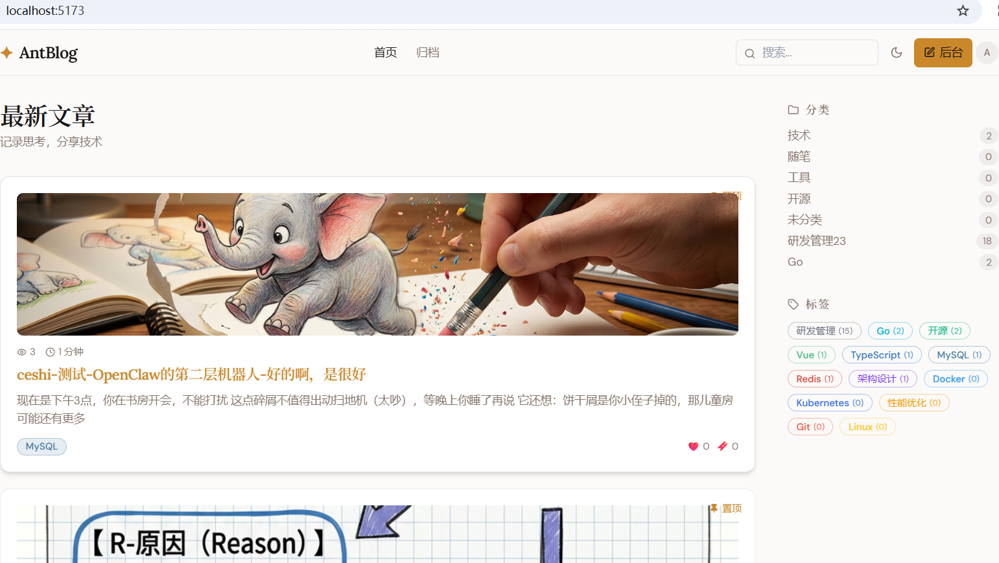
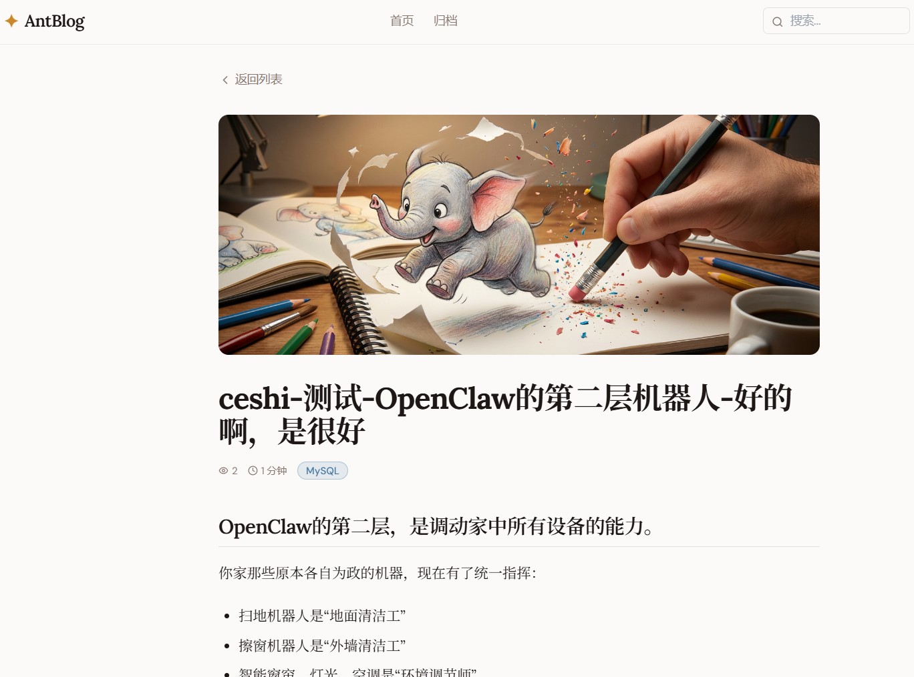
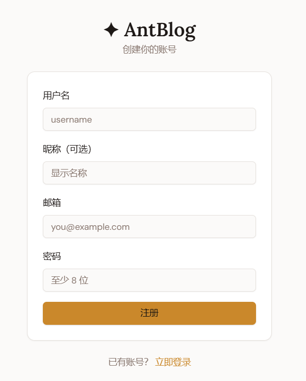
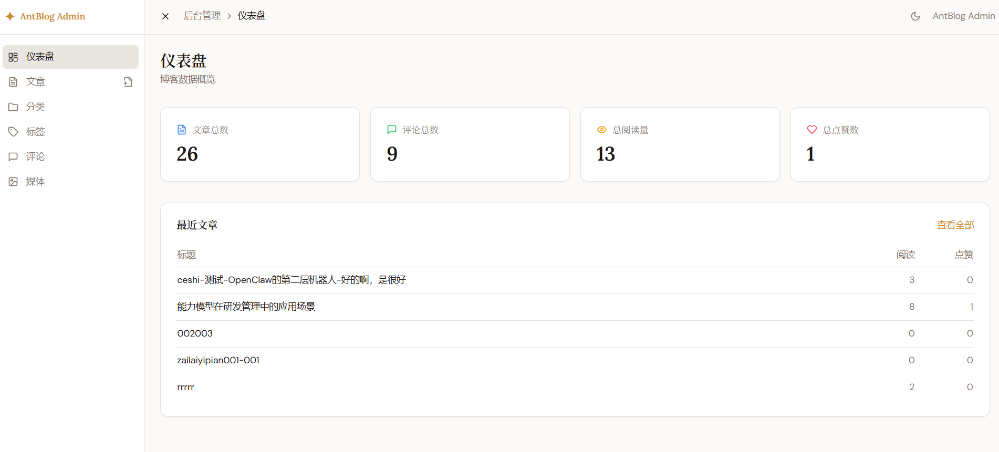

# AntBlog 蚂蚁博客

## 博客介绍

AntBlog 是一个前后端分离的博客系统，Go 语言实现，包含前台博客站点与后台管理系统，支持文章写作、发布、归档、评论、标签分类、媒体上传、简单权限管理等完整流程。

> ⚠️：用 DDD 写此博客，是为了练习 DDD 领域驱动设计架构。写这个博客，用 DDD 实施起来，代码量大，感觉小项目写的话很多没必要接口、分层、值对象等，一般简单项目用传统的 MVC 或 Go 项目标准布局以及它的变种就能实现。
>
> 比如博客项目，功能少、简单。


**特此声明**：

> **这是一个供程序学习用的应用 - 博客，里面有很多程序和功能不完善，可能出现错误以及bug，请谨慎用到实际环境中**。
>
> **仅供学习之用**。


**首页**：




**文章浏览页面**：



**注册页面**：



**后台管理首页**：



## 核心亮点

- DDD + 分层架构，领域模型与基础设施解耦，便于业务演进
- 双端路由体系，前台 `/api/v1/*` 与后台 `/api/admin/*` 清晰分离
- 完整内容链路，Markdown 写作、预览、发布、归档、搜索、互动
- 统一错误码与响应结构，便于前后端联调和排障
- 支持 Docker 与 Docker Compose 一键部署

## 功能清单

### 前台能力

- 用户注册、登录、登出、Token 刷新
- 首页最新文章与分页展示
- 文章详情、点赞、收藏
- 评论发布与评论树展示
- 分类页、标签页、归档页、搜索页
- Markdown 样式渲染与图片展示

### 后台能力

- 管理员登录、鉴权、权限控制
- 文章新建/编辑/发布/归档/删除
- 分类管理、标签管理
- 评论审核与管理
- 媒体上传与图片管理
- 仪表盘与快捷入口（含新建文章快捷按钮）

默认管理员账号（dev 环境）：

- 用户名：`admin`
- 密码：`Admin@2026`

## DDD 领域驱动设计

后端目录 `antblog-server/internal` 采用明确的 DDD 分层：

- `domain`：领域实体、值对象、领域服务、仓储接口
- `application`：用例编排、DTO、事务边界、跨聚合业务流程
- `infrastructure`：仓储实现、缓存实现、存储实现
- `interfaces`：HTTP Handler、Router、中间件、参数校验

依赖方向保持为：

- `interfaces -> application -> domain <- infrastructure`

这种结构保证了：

- 业务规则不依赖 Gin/GORM 等框架实现
- 核心业务可测试、可替换、可演进
- 基础设施升级时对业务影响最小

## 技术栈

### 后端

- Go
- Gin
- GORM
- Fx（依赖注入）
- Zap（日志）
- Viper（配置）
- Validator（参数校验）
- JWT
- Redis
- MySQL

### 前端

- Vue 3
- TypeScript
- Vite
- Pinia
- Vue Router
- Tailwind CSS
- shadcn/ui

## 快速启动（本地）

1. 启动 MySQL 与 Redis
2. 执行建表 SQL：`antblog-server/docs/sqls/sqls.sql`
3. 检查配置：`antblog-server/config/config.yaml`
4. 启动后端：

```bash
cd antblog-server
go run .\cmd\server\main.go
```

5. 启动前端：

```bash
cd antblog-web
npm install
npm run dev
```

## Docker 部署脚本

已提供 PowerShell 部署脚本（目录：`antblog-server/scripts/`）：

- `deploy-docker.ps1`：使用 `docker build + docker run` 方式启动 MySQL、Redis、Server
- `deploy-compose.ps1`：使用 Docker Compose 方式一键构建并启动全套服务
- `deploy-docker.sh`：Linux 环境使用 `docker build + docker run` 启动
- `deploy-compose.sh`：Linux 环境使用 Docker Compose 一键启动

执行示例：

```powershell
cd antblog-server\scripts
.\deploy-docker.ps1
```

```powershell
cd antblog-server\scripts
.\deploy-compose.ps1
```

Linux 执行示例：

```bash
cd antblog-server/scripts
chmod +x deploy-docker.sh deploy-compose.sh
./deploy-docker.sh
```

```bash
cd antblog-server/scripts
./deploy-compose.sh
```

可选参数示例：

```powershell
.\deploy-compose.ps1 -ProjectName antblog -AppPort 8080 -MySQLRootPassword root123456 -RedisPassword foofoo
```

```bash
PROJECT_NAME=antblog APP_PORT=8080 MYSQL_ROOT_PASSWORD=root123456 REDIS_PASSWORD=foofoo ./deploy-compose.sh
```

## 配置说明

主配置文件：

- `antblog-server/config/config.yaml`

可通过环境变量覆盖配置，前缀为 `ANTBLOG_`，例如：

- `ANTBLOG_SERVER_PORT`
- `ANTBLOG_DATABASE_DSN`
- `ANTBLOG_REDIS_ADDR`
- `ANTBLOG_REDIS_PASSWORD`

## 项目文档

- [后端架构文档](./antblog-server/docs/antblog-backend-structure.md)
- [前端架构文档](./antblog-server/docs/antblog-frontend-structure.md)
- [数据库 SQL](./antblog-server/docs/sqls/sqls.sql)

